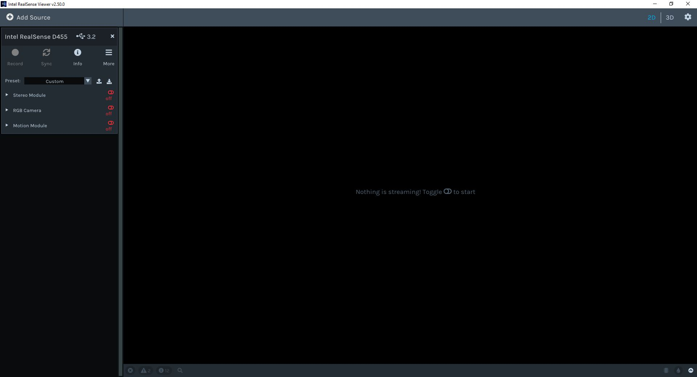

# Dataset Requirement Documentation:
## Required Tools:
### Hardware:
1. Intel RealSense D455 - 2
2. USB-C cable
3. PC running Windows 10

### Software:
1. Intel Realsense SDK 2.0 - https://github.com/IntelRealSense/librealsense/releases/download/v2.53.1/Intel.RealSense.SDK-WIN10-2.53.1.4623.exe

##  Installation Steps:
1. Download the Realsense SDK 2.0 Setup ***Intel.RealSense.SDK-WIN10-2.53.1.4623.exe*** from the above link. (approx 728MB)
2. Accept the User Account Control by clicking YES.
3. Follow the on-screen instruction to proceeed.  
     
     
     
     
     
   By default the SDK will be installed in  
   *C:/Program Files(x86)/Intel RealSense SDK 2.0* directory on your windows machine  
     

## Frame Configuration and Recording Steps:
1. Open the Realsense Viewer application.  
     
2. Connect the Intel RealSense Camera to the USB 3.0 port of the PC  
3. You should see your device connected.  
     
4. Update the **Firmware** (If there is a popup) and enable **Frame Metadata**.  
     
5. Turn ON the Stereo View toggling the Stereo Module.  
6. Configure the below parameters,
    - Tune the Minimum and Maximum distance value in meters between the camera lens and the object of interest(here person in the field of view)
    - Make sure there are no dead depth pixels around the area of interest. The image below has dead pixels around the person.  
         
    - Change the color scheme to **Black to White**.
    - Set the resoltion to 640x480 and FPS to 30
    - Post processing ON  
         
7. Turn ON the RGB Camera View toggling the RGB Camera Module.  
8. Configure the below parameters,
    - Set the resoltion to 640x480 and FPS to 30
     - Under Available streams,  
     Enable Color and select RGB8,  
     Enable Auto Exposure
      - Post-Processing ON  
      
9. Click on the **Record** button.
10. Click on **STOP** button to stop recording.
11. The RealSense Viewer application saves a **.bag** file.

## Extraction of frame data from the raw .bag file:
1. Open Windows Powershell on your computer.
2. Navigate to the Realsense SDK installation directory.\
   `cd ..\..\Program Files (x86)\Intel RealSense SDK 2.0\tools\`
3. Invoke the re-convert.exe with the following command to extract frames in CSV and metadata text files for each in frame.\
   `.\rs-convert.exe -i .\<inputfile.bag> -v <path-to-the-output-directory>`
4. Invoke the re-convert.exe with the following command to extract frames into binary file format BIN.\
   `.\rs-convert.exe -i .\<inputfile.bag> -b <path-to-the-output-directory>`
5. Invoke the re-convert.exe with the following command to extract frames into PNG file format.\
   `.\rs-convert.exe -i .\<inputfile.bag> -p <path-to-the-output-directory>`
6. Reference link for more options, [https://github.com/IntelRealSense/librealsense/tree/master/tools/convert](https://github.com/IntelRealSense/librealsense/tree/master/tools/convert)
7. Reference image  
   

<!-- ## To Validate the recorded frames alignment
1. Copy a set of color and depth frame to the [input](inputs) directory, and 
2. Execute the MATLAB script frame_fuse.mlx given [here](MATLABscripts\frame_fuse.mlx) making necessary changes to read the new input file.
3. The output is available in the [outputs](outputs) directory. -->

## Exporting .bag file to frames (color frame aligned to depth frame):
1. The RealSense Viewer application saves a **.bag** file.
2. Edit the filepath in Line 10 of *extractBag.py*.
3. Execute the python file **extractBag.py** from \
`./python_scripts/extractBag.py` 
4. Input number 2 as input to process the bag file and save its content on disk.
5. The script saves the below items
   - camera_intrinsics.txt
   - video file of the recording streams stacked horizontally,
   - depth
      - npy - shape=480,640
      - png - colorized depth, shape=480,640,1
   - RGB
      - npy
      - png
   - aligned_rgbd
      - npy
      - png
      
5. After the execution observe the console for number of frames saved. Make sure the output of rs-convert and the number of frames displayed on console matches. 

## Video Playback:(Optional)
1. Execute the python file **extractBag.py** from \
`./python_scripts/extractBag.py` 
2. Input number 1 for video playback.
3. Another option is using *playback.py* 
4. Edit the 'filename' variable in Line 18 of playback.py. Edit the fps value in Line 30 with the value cofigured during the recording process.
5. Execute the python file **playback.py** from *SDSU_PSG_RGBD/python_scripts/playback.py* 
6. Run the script, you should see a window **Depth Stream** playing the video frames.
7. Once all the frames are viewed in the window, the window closes automatically and the total number of frames are displayed/printed out.
**" Total Number of Frames in the bag file = # "** 

## Camera view point options:
|  | Camera 1 (C1) | Camera 2 (C2) |
| :----: | :----: | :----: |
| Setup 1 | 0&deg; | 90&deg; |
| Setup 2 | -25&deg; | 25&deg; |
| Setup 3 | Front View | Top View |
| Setup 4 | TBD | TBD |

## Video Stream Settings:
1. Synchronize C1 and C2. (ref. hardware timestamp) https://dev.intelrealsense.com/docs/frame-management#frame-syncer
2. Synchronize/Aligned RGB and Depth frames of each camera. https://dev.intelrealsense.com/docs/projection-in-intel-realsense-sdk-20#frame-alignment
3. Frame Dimensions: 640x480 (WxH) @ 60fps
4. Internal queue size = 1  (attempt made to reduce the frame drops)

## Camera Parameters:
1. Intrinsic camera parameters: https://dev.intelrealsense.com/docs/projection-in-intel-realsense-sdk-20#intrinsic-camera-parameters
2. Extrinsic camera parameters: https://dev.intelrealsense.com/docs/projection-in-intel-realsense-sdk-20#extrinsic-camera-parameters
3. Focal length?

## Key details to be recorded manually:
1. The actual distance between the camera and the participant?
2. Height at which the cameras are mounted?

## Participant record:
| Participant ID | Gender | Age | Height(units) | Weight(units) |
| :----: | :----: | :----: | :----: | :----: |
| P1 | M | 50 | 175 cm | 80 Kg |
| P2 | F | 40 | 150 cm | 60 Kg |
| P3 | M | 30 | 189 cm | 70 Kg |
| Pn | M | - | - | - |

## Action Classes:
- A1. Normal Walking
- A2. Sitting on a couch
- A3. Getting off the couch
- A4. Stumble
- A5. Fainting
- A6. Falling
- A7. Hazardous Pose in workplace environment
- A8. Pushing other person.
- A9. Colliding to any object.

## Number of people in filed of view of C1 and C2
1. Single person
2. More than one person

## Structures of the datasets
- Datasets include 3 different modalities of data for each sample:
   - RGB videos
   - Depth map sequences
   - 2D and 3D skeletal data
   - infrared (IR) videos? (TBD)

## Data Split:
1. Data should be divided into Train, Validation and Test in the ratio of 60:20:20 

## Annotation:
1. Tool: COCO Annotator [repo link](https://github.com/jsbroks/coco-annotator)
2. Clone the repo from the above link.
3. Follow the instructions in readMe file available in COCO Annotator repository.
4. Start the docker.  
5. Move the frames to Dataset directory.
   - Convert the fused frames.npy(output from the execution of save_bag2aligned_frames.py) to png/jpg from MATLAB - **WIP**
5. Categories
   - Boundary box per person in frame [Xmin, Ymin, Xmax, Ymax]
   - 2D coordinates of HumanPose  
   `15 keypoints = 
 {
    0: 'Head',
    1: 'Neck',
    2: 'RShoulder',
    3: 'LShoulder',
    4: 'RElbow',
    5: 'LElbow',
    6: 'RHand',
    7: 'LHand',
    8: 'Torso',
    9: 'RHip',
    10: 'LHip',
    11: 'RKnee',
    12: 'LKnee',
    13: 'RFoot',
    14: 'LFoot',
}`
   - Fall / No-Fall
6. Sample frame being annotated.
   
   In the above figure,
   1. the frame that we see is a blend frame of RGB and Depth frames 
   2. It is visible that RGB and Depth frames are not aligned to each other. Hence the discrepencies. 
   3. The pale red color box is the boundary box covering the region of the person.
   4. The keypoints represents the 15 joint position of interest.
7. After completion of annotating all the frames, export the annotations to any other directory on your workstation.

## File Naming Convention:
- Each file/folder name is in the format of SsssCcccPpppRrrrAaaa (e.g., S001C002P003R004A005), in which
   - sss is the setup number, (Camera Setup) 
   - ccc is the camera ID (1 or 2),
   - ppp is the participant (subject) ID, 
   - rrr is the replication number (1 or 2), and 
   - aaa is the action class label.

## Reference Dataset available
1. [https://falldataset.com/](https://falldataset.com/)
2. [http://fenix.ur.edu.pl/mkepski/ds/uf.html](http://fenix.ur.edu.pl/mkepski/ds/uf.html)
3. [https://sites.google.com/site/occlusiondataset/](https://sites.google.com/site/occlusiondataset/)
4. [http://vlm1.uta.edu/~athitsos/publications/zhang_isvc2014.pdf](http://vlm1.uta.edu/~athitsos/publications/zhang_isvc2014.pdf)

