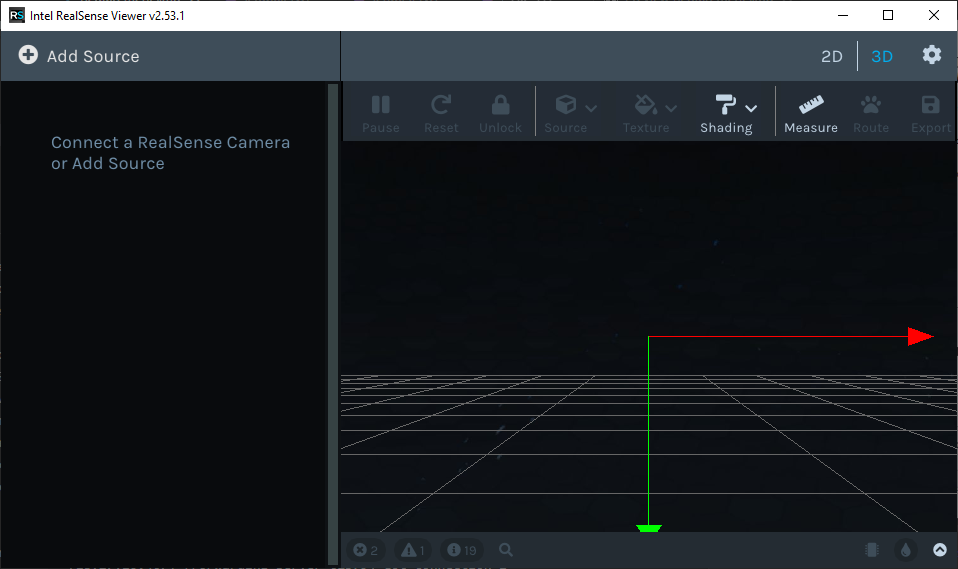

# Dataset Requirement Documentation:
## Required Tools:
### Hardware:
1. Intel RealSense D455 - 2
2. USB-C cable
3. PC running Windows 10

### Software:
1. Intel Realsense SDK 2.0 - https://github.com/IntelRealSense/librealsense/releases/download/v2.53.1/Intel.RealSense.SDK-WIN10-2.53.1.4623.exe
 https://github.com/IntelRealSense/librealsense/releases/download/v2.49.0/Intel.RealSense.Viewer.exe

##  Installation Steps:
1. Download the Realsense SDK 2.0 Setup ***Intel.RealSense.SDK-WIN10-2.53.1.4623.exe*** from the above link. (approx 728MB)
2. Accept the User Account Control by clicking YES.
3. Follow the on-screen instruction to proceeed.  
     
     
     
     
     
   By default the SDK will be installed in  
   *C:/Program Files(x86)/Intel RealSense SDK 2.0* directory on your windows machine  
     

## Frame Configuration and Recording Steps:
1. Open the Realsense Viewer application.  
     
2. Connect the Intel RealSense Camera to the USB 3.0 port of the PC  
3. You should see your device connected.  
     
4. Update the **Firmware** (If there is a popup) and enable **Frame Metadata**.  
5. Turn ON the Stereo View.  
6. Configure the below parameters,
    1. Tune the Minimum and Maximum distance value in meters between the camera lens and the object of interest(here person in the field of view)
    2. Make sure there are no dead depth pixels around the area of interest. The image below has dead pixels around the person.  
         
    3. Change the color scheme to **Black to White**.
    4. Set the resoltion to 640x480 and FPS to 60 (TBD)
    5. Post processing ON/OFF 
7. Click on the **Record** button.

## Video Playback:
1. After recording the video, click on **STOP** button to stop recording.
2. The RealSense Viewer application saves a **.bag** file.
3. Execute the python file **playback.py** from *SDSU_PSG_RGBD/python_scripts/playback.py* 
4. Edit the file name in Line 26 of playback.py. Edit the fps value in Line 30 with the value cofigured during the recording process.
5. Run the script, you should see a window **Depth Stream** playing the video frames.
6. Once all the frames are viewed in the window, the window closes automatically and the total number of frames are displayed/printed out.
**" Total Number of Frames in the bag file = # "** 

## Camera view point options:
|  | Camera 1 (C1) | Camera 2 (C2) |
| :----: | :----: | :----: |
| Setup 1 | 0&deg; | 90&deg; |
| Setup 2 | -25&deg; | 25&deg; |
| Setup 3 | Front View | Top View |
| Setup 4 | TBD | TBD |

## Video Stream Settings:
1. Synchronize C1 and C2. (ref. hardware timestamp) https://dev.intelrealsense.com/docs/frame-management#frame-syncer
2. Synchronize/Aligned RGB and Depth frames of each camera. https://dev.intelrealsense.com/docs/projection-in-intel-realsense-sdk-20#frame-alignment
3. Frame Dimensions: 640x480 (WxH) @ 60fps
4. Internal queue size = 1  (attempt made to reduce the frame drops)

## Camera Parameters:
1. Intrinsic camera parameters: https://dev.intelrealsense.com/docs/projection-in-intel-realsense-sdk-20#intrinsic-camera-parameters
2. Extrinsic camera parameters: https://dev.intelrealsense.com/docs/projection-in-intel-realsense-sdk-20#extrinsic-camera-parameters
3. Focal length?

## Key details to be recorded manually:
1. The actual distance between the camera and the participant?
2. Height at which the cameras are mounted?

## Action Classes:
1. A1. Normal Walking
2. A2. Sitting on a couch
3. A3. Getting off the couch
4. A4. Stumble
5. A5. Fainting
6. A6. Falling
7. A7. Hazardous Pose in workplace environment
8. A8. Pushing other person.
9. A9. Colliding to any object.

## Number of people in filed of view of C1 and C2
1. Single person
2. More than one person

## Structures of the datasets
- Datasets include 3 different modalities of data for each sample:
   - RGB videos
   - Depth map sequences
   - 2D and 3D skeletal data
   - infrared (IR) videos (TBD)

## Data Split:
1. Data should be divided into Train, Validation and Test in the ratio of 60:20:20 

## Annotation:
1. Tool: [COCO Annotator](https://github.com/jsbroks/coco-annotator)
2. Clone the repo from the above link.
3. Follow the readMe file available in the COCO Annotator repository.
4. move the frames to Dataset directory.
5. Categories
   - Boundary box per person in frame [Xmin, Ymin, Xmax, Ymax]
   - 2D coordinates of HumanPose  
   `15 keypoints = 
 {
    0: 'Head',
    1: 'Neck',
    2: 'RShoulder',
    3: 'LShoulder',
    4: 'RElbow',
    5: 'LElbow',
    6: 'RHand',
    7: 'LHand',
    8: 'Torso',
    9: 'RHip',
    10: 'LHip',
    11: 'RKnee',
    12: 'LKnee',
    13: 'RFoot',
    14: 'LFoot',
}`
   - Fall / No-Fall

## File Naming Convention:
- Each file/folder name is in the format of SsssCcccPpppRrrrAaaa (e.g., S001C002P003R004A005), in which
   - sss is the setup number, (Camera Setup) 
   - ccc is the camera ID (1 or 2),
   - ppp is the participant (subject) ID, 
   - rrr is the replication number (1 or 2), and 
   - aaa is the action class label.

